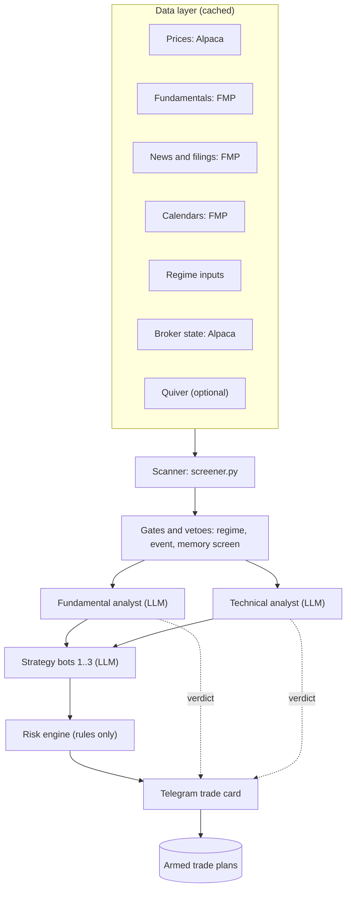
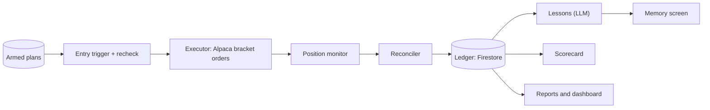

# AI Trading Bots: Design Document

Version 1.0 · 2026-10-07 · Status: design frozen except the items under "Pending decisions"

Companion file: `TASKS.md` (staged technical tasks with checkboxes).

---

## 0. Pending decisions

| # | Decision | Default in this doc | Where |
|---|---|---|---|
| P1 | Production hosting: Google Cloud VM vs a VPS | GCP VM (start on the free e2-micro, resize if memory-bound) | Section 15 |
| P2 | Live broker eligibility (Alpaca live accounts for non-US residents) | Unverified. Must be checked before any live plan. | Section 16 |
| P3 | Final strategy set | Breakout, trend pullback, mean reversion. Replaceable if backtests are not convincing. | Section 6 |

Everything else is decided and recorded in the decision log (section 2).

---

## 1. Goals, non-goals, reality checks

### 1.1 Goals

1. Build three AI-assisted trading bots, each owning one strategy and one budget sleeve, all driven by config.
2. Target up to 10 trades a day (cap, never a quota) with a configurable reward:risk of about 1:3 (1:2 for mean reversion).
3. Start with a configurable initial capital (default 5,000 USD) on Alpaca paper trading.
4. Keep a trade ledger and learning memory in Firestore so bots stop repeating losing setups.
5. Put a human in the loop: every trade call reaches Telegram together with both analyst verdicts.
6. Backtest every strategy before paper trading; judge each bot on paper results before any live decision.
7. Expose a web performance review screen.

### 1.2 Non-goals (v1)

- Short selling, options, crypto, margin, high-frequency trading.
- Fully autonomous trading (approval stays manual until a bot has earned a lower-friction mode).
- Promising returns. This is an engineering and research project.

### 1.3 Reality checks that shape the design

| # | Fact | Design consequence |
|---|---|---|
| R1 | A daily-bar scan over about 400 stocks yields few quality signals a day. | 10 trades/day is a cap. Scan on daily bars, time entries with intraday bars. |
| R2 | 1:3 reward:risk is only hit sometimes, and more rarely over short holds. | R:R is per strategy and configurable. Judge by expectancy in R, not win rate. |
| R3 | Small margin accounts face US pattern-day-trader limits (the rule has been under revision; check the current FINRA rule before live). | Swing holding (overnight) by default, with a PDT guard in the risk engine. |
| R4 | LLMs are advisors, not risk managers. | Sizing, stops, circuit breakers and the kill switch are deterministic code. No LLM can override them. |
| R5 | Paper fills are optimistic. | Backtest and paper reports model slippage and track fill quality; compare paper vs backtest drift before going live. |
| R6 | LLM verdicts cannot be honestly backtested on history (the model has seen it). | Backtest only rule-based logic. Measure analyst quality forward in paper trading (verdict scorecard). |
| R7 | Running costs are large relative to a 5,000 USD account (see section 14.4). | Stay on free tiers until the strategy proves itself. Treat as R&D. |
| R8 | You are in India; US markets trade roughly 19:00-01:30 IST (until US clocks change on 1 Nov 2026, then an hour later). | Approve plans, not clicks: scan after the close, approve during your day, system triggers entries during market hours. |

---

## 2. Decision log

| Area | Decision |
|---|---|
| Language | Python 3.12 |
| Broker | Alpaca. Paper first. Broker access is behind an interface so it can be swapped. |
| Holding style | Swing (hold 1-15 days), long-only, intraday entry timing |
| Strategies | Breakout momentum, trend pullback, mean reversion. Pluggable and replaceable. |
| Budget split | 40 / 35 / 25 percent of capital (config) |
| Database | Firebase Firestore (Spark plan first) |
| Fundamentals / universe data | Financial Modeling Prep (FMP): free tier for development, Starter when scanning the full universe |
| Price data | Alpaca market data (free IEX feed for paper) |
| Alt-data | Quiver: deferred, optional, trial in a later phase |
| LLM | Anthropic Claude API for analyst bots and strategy bots. Model name set in config. |
| Approval | Telegram bot. Approve the plan; the system arms and triggers it. |
| Analyst policy | Both verdicts shown on the card. Split verdict is flagged; human decides. |
| Plan expiry | End of the next US session (config) |
| Memory | Deterministic rules from Firestore stats and blocklist. Semantic lesson search deferred. |
| Dashboard | Firebase Hosting web app reading rollups from Firestore |
| Process | Strategy replaced if backtest acceptance gates are not met |

---

## 3. Architecture

### 3.1 Decision pipeline (runs after the US close)



### 3.2 Execution and learning loop (market hours and after)



Cross-cutting (always on): scheduler, heartbeat, kill switch, cost meter, config/prompt version tags.

### 3.3 Daily timeline

Times shown for US daylight time (EDT). Until 1 Nov 2026 IST = ET + 9:30; after US clocks change IST = ET + 10:30.

| ET | IST (EDT) | Job |
|---|---|---|
| 17:00 | 02:30 | EOD ingest, scan, gates, analysts, strategy bots, risk checks, send cards |
| 17:30 to 09:00 next day | 03:00 to 18:30 | Approval window (your daytime). Approve arms a plan. |
| 09:00 | 18:30 | Unapproved proposals expire; armed plans loaded by the trigger watcher |
| 09:45 to 15:45 | 19:15 to 01:15 | Trigger watcher and position monitor. Entries only in this window. |
| 16:15 | 01:45 | Reconcile broker vs ledger |
| 16:30 | 02:00 | Lessons, scorecard, daily report, rollups |

Timing is config-driven and uses the market calendar (holidays, half days).

### 3.4 Module responsibilities

| Module | Responsibility | LLM? |
|---|---|---|
| `data` | Provider adapters (Alpaca, FMP, Quiver), cache, universe builder | No |
| `scanner` | Config-driven filter engine (`screener.py`) | No |
| `gates` | Regime gate, event/news veto, memory screen | No |
| `strategies` | Plugin interface and the three strategy plugins (pure functions) | No |
| `analysts` | Fundamental and technical verdicts (structured JSON) | Yes |
| `bots` | Strategy bots assemble proposals using analyst output and memory | Yes (advisory text only) |
| `risk` | Sizing, limits, circuit breakers, kill switch | No |
| `approval` | Telegram cards, commands, plan lifecycle | No |
| `execution` | Trigger watcher, recheck, executor, position monitor, reconciler | No |
| `ledger` | Firestore repositories, snapshots, rollups, setup stats | No |
| `learning` | Lesson writer (LLM), blocklist updates (rules) | Partly |
| `backtest` | Simulator, costs, walk-forward, reports | No |
| `reports` | Daily/weekly reports, scorecard | No |
| `ops` | Scheduler, heartbeat, cost meter, logging, secrets | No |

Key interfaces (Python `Protocol`s): `MarketDataProvider`, `FundamentalsProvider`, `Broker`, `Ledger`, `Strategy`, `Analyst`, `Notifier`. Swapping a provider or broker is a new adapter, not a refactor.

---

## 4. Config-driven design

Config lives in `config/` as YAML, validated by pydantic at startup. Every run records the config hash (`config_version`) on the trades it produces.

```yaml
# config/default.yaml
account:
  initial_capital: 5000
  mode: paper                  # paper | live (live requires explicit flag and separate keys)
trade_limits:
  max_trades_per_day: 10       # cap, never a target
  entry_window_et: ["09:45", "15:45"]
approval:
  plan_expiry: end_of_next_session
  verdict_policy: flag_for_human     # flag_for_human | require_both_non_avoid
  analyst_mode: advisory             # shadow | advisory
strategies:
  - id: breakout_v1
    plugin: strategies.breakout
    bot: bot_1
    budget_pct: 40
    risk_reward: 3.0
    risk_per_trade_pct: 1.0
    universe: nasdaq100
    status: active                   # active | paused | retired
  - id: pullback_v1
    plugin: strategies.trend_pullback
    bot: bot_2
    budget_pct: 35
    risk_reward: 3.0
    risk_per_trade_pct: 1.0
    universe: nyse300_nonfin
    status: active
  - id: meanrev_v1
    plugin: strategies.mean_reversion
    bot: bot_3
    budget_pct: 25
    risk_reward: 2.0
    risk_per_trade_pct: 1.0
    universe: both
    status: active
universes:
  nasdaq100: { source: fmp_index, index: NASDAQ100 }
  nyse300_nonfin: { source: fmp_screener, exchange: NYSE, top_n: 300, exclude_sectors: ["Financial Services"], refresh: monthly }
  both: { union: [nasdaq100, nyse300_nonfin] }
data:
  fundamentals_provider: fmp
  alt_data: { quiver_enabled: false }
llm:
  analyst_model: "<set model id>"     # chosen at S7; keep configurable
  daily_budget_usd: 2.00
  max_candidates_per_day: 15
```

Risk limits live in `config/risk.yaml` (section 8). Strategy parameters live in `config/strategies/<id>.yaml`.

---

## 5. Data layer

### 5.1 Sources and tier gates

| Need | Source | Plan gate |
|---|---|---|
| Daily and intraday bars, broker clock, calendar, account/positions | Alpaca | Free (paper) |
| Universe lists, fundamentals and ratios, news, filings, calendars, sector performance, estimates | FMP | Free for development (limited symbols per FMP's Basic plan). Starter when scanning the full universe. Premium only if a specific gap appears (quarterly fundamentals, indicators, calendar endpoint tier). |
| Insider, Congress, contracts, lobbying, off-exchange | Quiver (or FMP's own insider/Congress endpoints first) | Deferred. Trial on a monthly plan in a later phase. |

Verify which FMP endpoints sit in which tier before relying on them (use their API viewer).

### 5.2 Rules

- Cache everything to local Parquet plus a small manifest. Fundamentals refresh nightly or weekly, bars daily.
- Store the public/filing date with fundamentals. The backtest uses data only after it was public (no look-ahead).
- Adjust prices for splits and dividends consistently; keep raw and adjusted.
- Data quality checks: gaps, stale bars, zero volume, outliers, ticker changes.
- Universe: NASDAQ-100 constituents; NYSE top 300 by market cap excluding the financial sector, refreshed monthly. Point-in-time membership for backtests is a known gap (survivorship bias); record the limitation in every backtest report.

### 5.3 MCP use

REST in the pipeline (deterministic, cacheable). MCP only for analyst bots' on-demand lookups: read-only, allow-listed toolsets, per-candidate call cap. Quiver publishes an official MCP server (included with its API plans). FMP's MCP servers appear community-built: pin versions, run in a container, review code before use.

---

## 6. Strategies

### 6.1 Plugin interface

Strategies are pure functions of data (no I/O), so the exact code runs in backtest and live.

```python
class Strategy(Protocol):
    id: str
    def required_features(self) -> list[FeatureSpec]: ...
    def regime_ok(self, regime: Regime) -> bool: ...
    def scan(self, ctx: ScanContext) -> list[Candidate]: ...
    def build_plan(self, cand: Candidate, ctx: PlanContext) -> TradePlan | None: ...
    def manage(self, pos: Position, ctx: ManageContext) -> list[ExitAction]: ...
```

Registered by plugin path in config. Adding a strategy = new module + YAML + passing backtest report. Retiring = `status: retired` (history keeps `strategy_id` and version).

### 6.2 The three starting strategies

Parameter values are starting hypotheses to be tested and tuned out-of-sample, not claims.

| | Breakout momentum | Trend pullback | Mean reversion |
|---|---|---|---|
| Universe | Nasdaq 100 | NYSE top 300 non-financial | Both |
| Regime | Index above 200-day average, breadth not collapsing | Same as breakout | Not in a downtrend regime |
| Setup | Close above 55-day high; volume at least 1.5x 20-day average; price above 200-day average; ATR% within limits | 50-day above 200-day and rising; pullback into the 20/50 EMA zone; RSI(14) dips below 45 then turns up; close above prior day's high | Close above 200-day average; RSI(2) below 10 (or close below lower Bollinger band); quality screen (positive EPS, leverage cap) |
| Entry | Buy-stop above breakout level, confirmed on intraday close | Buy above trigger bar high | Limit near next open/close, no chase |
| Stop | Below breakout base or 1.5 x ATR(14) | Below pullback swing low or 1.5 x ATR | 2 x ATR |
| Target | 3R | 3R | 2R, or exit when close is above 5-day average |
| Management | Stop to breakeven at 1R; time stop 10 days | Stop to breakeven at 1R; time stop 15 days | Time stop 5 days |
| Skip when | Earnings within 5 days; gap already above entry | Earnings within 5 days | Earnings within 5 days; falling-knife news veto |

### 6.3 Acceptance gates (proposed, configurable in `config/acceptance.yaml`)

A strategy goes to paper trading only if the out-of-sample backtest shows all of:

- At least 100 trades across at least 3 years (or the strategy is flagged "insufficient evidence").
- Expectancy at least +0.15R after costs and slippage.
- Profit factor at least 1.3.
- Max drawdown at most 20 percent of the sleeve.
- Positive in at least 60 percent of walk-forward folds.
- Neighboring parameter values (plus/minus 20 percent) stay positive (no knife-edge optimum).
- A final holdout period (most recent 12 months) untouched until the very end.

### 6.4 Replacement protocol

1. A strategy fails the gates, or underperforms in paper (below the paper-vs-backtest drift tolerance, or negative expectancy over its minimum trade count).
2. Mark it `paused`. Its sleeve goes unused or is reallocated in config.
3. Pick a candidate from the backlog, write the plugin, run the same backtest harness and gates.
4. Pass: set `active`. Record why the old one was retired in the decision log.

Backlog of replacement ideas (each needs its own backtest): post-earnings drift, 52-week-high momentum, sector-rotation momentum, gap fade, opening-range breakout (intraday: PDT and intraday data needs apply), VWAP reversion (intraday).

---

## 7. Backtest design

- Engine: a small bar-by-bar simulator that calls the exact live strategy functions. vectorbt is optional for fast parameter sweeps, never the source of truth.
- Fill model: daily bars with conservative rules. If stop and target are both hit in a bar, assume the stop first. Gaps fill at the open, not the stop. Entry triggers fill at the worse of trigger and open.
- Costs: configurable slippage (basis points plus half spread) and regulatory fees. Alpaca equity commission is zero, but costs are modeled anyway.
- Walk-forward: rolling train/test folds. Report stability across folds.
- Sizing: uses the same risk engine functions as live (sleeve risk percent, position caps, whole shares).
- Outputs per run: trade list, equity curve, expectancy in R, win rate, average win/loss, profit factor, max drawdown, exposure, holding time, MAE/MFE, monthly returns, regime breakdown, parameter sensitivity, benchmark (SPY/QQQ buy-and-hold), data-bias warnings.
- Hygiene: limit free parameters, write down hypotheses first, keep a holdout, and log every run (config hash, data version).

---

## 8. Risk management (defaults, all in `config/risk.yaml`)

| Rule | Default |
|---|---|
| Risk per trade | 1.0 percent of the strategy sleeve (position size = risk dollars divided by entry minus stop) |
| Max single position | 20 percent of the sleeve; skip if one share already exceeds it |
| Minimum reward:risk | Strategy R:R configured; reject if the plan falls below it |
| Max open positions | 5 total, 2 per strategy |
| Sector exposure | At most 2 positions per sector |
| Portfolio heat | Total open risk at most 4 percent of equity |
| Daily loss limit | -2 percent of equity: no new entries for the day |
| Strategy circuit breaker | -6 percent of sleeve or 5 consecutive losses: pause the bot and alert |
| Account kill switch | -10 percent from equity peak: flatten and stop everything, alert |
| Ticker cooldown | After 2 consecutive losses in a ticker, block for 10 days |
| Entry window | No entries in the first 15 or last 15 minutes of the session |
| Event veto | No entry if earnings within 5 trading days; stand-down days for major macro events (config list) |
| Liquidity | Minimum price and average dollar volume; maximum spread percent |
| PDT guard | Block orders that would breach the day-trade limit (verify current rule and the broker's day-trade counter) |
| Trades per day | Max 10 (cap) |
| Stale plan | Recheck price drift, buying power and risk before every order |
| Fractional shares | Default off (whole shares). Verify broker support for fractional with bracket orders before enabling. |

Manual controls over Telegram: `/halt` (stop new entries), `/resume`, `/flatten` (close all), `/status`.

---

## 9. Approval flow

### 9.1 Trade card (Telegram)

```
TRADE CALL: Breakout | NVDA | LONG
Entry: buy-stop 118.40 (zone 118.40-119.10)
Stop: 114.20 (1.5 ATR) | Target: 131.00 (3.0R) | R:R 1:3.0
Size: 4 sh (about 476 USD) | Risk: 17.00 USD (0.85% of sleeve)
Plan expires: Thu 16:00 ET

Technical analyst: BUY (0.72): reasons...
Fundamental analyst: HOLD (0.55): reasons...   SPLIT VERDICT
Memory: setup stats n=14, expectancy -0.12R; 2 similar losses in 30 days
Flags: earnings in 9 days | sector slots 1/2
Risk engine: PASS (heat 1.9% of 4%)

[Approve plan] [Reject] [Details]
```

Rules: only your Telegram user id is accepted; buttons carry a one-time token; double taps are idempotent; every action is written to the audit log.

### 9.2 Plan lifecycle

`PROPOSED -> ARMED -> TRIGGERED -> ORDER_SENT -> OPEN -> CLOSED`
Side exits: `PROPOSED -> REJECTED | EXPIRED`, `ARMED -> EXPIRED | CANCELLED | RECHECK_FAILED`.

### 9.3 Trigger and recheck

The trigger watcher streams or polls intraday bars for armed plans. When the trigger fires, the recheck must pass before any order: price still within the entry zone plus slippage cap; no gap invalidation; risk engine re-run on live equity; buying power; PDT counter; not halted; no event veto; daily cap; kill switch off. Orders are bracket orders (entry plus stop plus target at the broker).

---

## 10. LLM layer

### 10.1 Analyst contract

```json
{
  "ticker": "NVDA",
  "analyst": "fundamental | technical",
  "verdict": "buy | hold | avoid",
  "confidence": 0.0,
  "horizon_days": 10,
  "reasons": ["..."],
  "red_flags": ["..."],
  "key_metrics": {"...": "..."},
  "data_used": ["..."],
  "prompt_version": "fa-0.1",
  "model": "<id>"
}
```

- Output validated against a pydantic schema. One retry on invalid output, then a "no verdict" state shown on the card (never silently treated as a pass).
- Verdicts cannot change size, stop or target. They inform the human and the scorecard.
- Prompts are versioned files; every verdict stores `prompt_version`, `model`, token counts and cost.
- Cache per (ticker, date, prompt_version). Run only on the post-gate shortlist (cap per day, config).
- Analyst mode `shadow` records verdicts without showing them (to measure predictive value); `advisory` shows them on the card.

### 10.2 Guardrails

- MCP tools: read-only allow-list per analyst; no order, Telegram or ledger-write tools in any LLM context.
- Fetched news and filing text is untrusted: treat as data, never as instructions.
- Hard daily cost cap (`llm.daily_budget_usd`); the cost meter pauses analysts when exceeded and alerts.
- Disagreement between analysts: card flagged `SPLIT VERDICT`; policy `flag_for_human` (default) or `require_both_non_avoid`.

### 10.3 Learning and memory

1. On trade close, the ledger writes the outcome in R, tags (strategy, sector, regime, setup fingerprint) and a decision snapshot reference.
2. A lesson writer (LLM) produces a short factual lesson from the snapshot plus outcome (stored, never used as a rule by itself).
3. Deterministic updates: `setup_stats` rollup (n, wins, expectancy R) per fingerprint; blocklist entries from rules (for example fingerprint expectancy below zero over at least 15 trades, or ticker cooldown).
4. The memory screen (code) blocks blocklisted setups before any LLM spend. Bots see stats and lessons as context on the card.

---

## 11. Firestore schema

Firestore is the system of record. All writes come from the backend (Admin SDK). Client rules are read-only for the owner.

| Collection | Key fields |
|---|---|
| `config_versions/{hash}` | content, createdAt |
| `prompt_versions/{id}` | text hash, role, createdAt |
| `strategies/{id}` | plugin, bot, budgetPct, params, status, configVersion |
| `candidates/{date_ticker_strategy}` | features summary, scan reason, gateResults |
| `verdicts/{id}` | candidateId, analyst, verdict, confidence, reasons, redFlags, promptVersion, model, tokens, costUsd |
| `proposals/{id}` | strategyId, ticker, entryZone, stop, target, rr, shares, riskUsd, riskCheck, memoryFlags, status, expiresAt |
| `plans/{id}` | proposalId, state, approvedAt, approver, trigger, expiry, recheckResult |
| `orders/{id}` | brokerOrderId, planId, type, status, fills, slippage |
| `trades/{id}` | strategyId, ticker, entry/exit time and price, qty, pnlUsd, rMultiple, holdDays, exitReason, setupFingerprint, regime, sector, snapshotId, configVersion |
| `snapshots/{id}` | exact inputs at decision time (features, indicator values, data refs), prompt and config versions |
| `lessons/{id}` | tradeId, text, tags, createdAt |
| `setup_stats/{fingerprint}` | n, wins, expectancyR, updatedAt |
| `blocklist/{id}` | ticker or fingerprint, reason, until |
| `positions/{ticker}` | broker mirror maintained by the reconciler |
| `daily_rollups/{date}` | equity, pnl, drawdown, per-strategy stats, counts |
| `system/state` | killSwitch, heartbeat, regime, lastRuns |
| `audit_log/{date_seq}` | time, actor (system, you, or a service name), action, planId, tradeId, reason, small payload, configVersion, codeVersion; append-only (see 13.3) |

Indexes: `trades` by (`strategyId`, `exitAt`) and (`setupFingerprint`, `exitAt`); `plans` by (`state`, `expiry`); `audit_log` by (`planId`, `time`) and (`action`, `time`).

Rules for `audit_log`: only the backend creates documents; nobody, including you, can update or delete them (the rules deny it, and the Admin SDK code has no update or delete path for this collection).

Quota notes (Spark plan: 1 GiB storage, 50,000 reads/day, 20,000 writes/day): expected writes are in the low hundreds per day. The dashboard must read `daily_rollups` and paged lists, never scan `trades`. Avoid always-on realtime listeners on growing collections (they multiply reads). Move to Blaze (pay as you go) only if quotas bind. Keep a nightly JSON export to VM storage as a backup.

---

## 12. Security and secrets

- Secrets from environment or a secret manager; none in the repo. `.env.example` only.
- Separate keys and separate config for paper and live. Live mode needs an explicit flag and a startup confirmation.
- Telegram: allow-list your user id; ignore all other chats.
- Firestore: backend uses a service account (on GCP, the VM's attached service account, no key file). Client rules deny writes. Dashboard auth limited to your account.
- MCP servers pinned and containerized; keys scoped read-only where the vendor allows.
- Never log secrets or full prompts containing keys.
- Prefer Google Secret Manager (or a locked-down file readable only by the service user) over a plain `.env` on the VM. Use separate credentials for the bots, for CI deploys and for the dashboard; rotate a key by creating the new one, switching the bots, then deleting the old one.

---

## 13. Testing and observability

### 13.1 Testing

- Unit tests: indicators, filters, sizing, every risk rule (table-driven, edge cases), plan state machine.
- Property tests: sizing never exceeds caps; stop always on the correct side of entry.
- Strategy tests: golden datasets; backtest regression (same inputs give same trades).
- Integration tests: Firestore emulator; Alpaca paper (small, tagged); Telegram sandbox chat.
- LLM tests: schema validation, injection fixtures, recorded-response replay.
- Replay mode: re-run a past day from stored snapshots to reproduce decisions.

### 13.2 Observability

Sized for one small VM: logs, a few metrics and alerts. No tracing stack, Prometheus or Grafana at this scale.

- Structured JSON logs. Every line carries `runId` and, once a plan exists, `planId`, so one search shows a trade's whole life (scan, verdicts, card, approval, recheck, order, fills, close).
- Heartbeat to Firestore every minute during market hours; alert on silence.
- Outside dead-man ping: a free external check (for example healthchecks.io) is pinged on every heartbeat and messages you when pings stop. A dead VM cannot alert you itself, so this one check must live off the VM.
- Metrics, written to `system/state` and the daily rollup, each with an alert threshold in config:

| Metric | Why it matters |
|---|---|
| Heartbeat age | The process is alive |
| Data freshness (last bar time per source) | Stale data must block entries |
| Scan duration and candidate count | A scan that returns zero is suspicious |
| API error rate per vendor (Alpaca, FMP, Anthropic, Telegram) | Early warning of an outage |
| Order latency (plan trigger to broker acknowledgement) | Slow fills widen slippage |
| Reconciliation differences (ledger against broker) | Any non-zero value is an incident |
| Slippage against the backtest assumption | Shows when paper results are too good |
| AI cost per day against the cap | Keeps the cost cap honest |

- Telegram alerts: errors, risk breaches, circuit breakers, reconciliation mismatches, cost cap hits, missing data, vendor outages.
- Daily report: equity, trades, rejects by reason, slippage vs expected, LLM cost.
- Log rotation and a size cap on the VM disk; keep 30 days locally.

### 13.3 Audit log

Purpose: answer "why did it do that?" months later, prove each order followed your approval, and give clean trade records for tax filing.

- Collection `audit_log`, append-only (rules and code forbid update and delete).
- Events recorded, each with time, actor, action, `planId`/`tradeId`, a short reason, `configVersion` and `codeVersion`:
  - Scan completed, candidate gated or vetoed (with the rule that vetoed it).
  - Verdict recorded (analyst, call, score, model, prompt version, cost, a hash of the prompt).
  - Proposal created, risk-engine decision and its reasons.
  - Approval or rejection (your Telegram user id), expiry, cancellation.
  - Recheck result, order sent (client order id), broker acknowledgement, each fill, order rejection.
  - Position closed, with exit reason.
  - Every command (`/halt`, `/resume`, `/flatten`), circuit-breaker and kill-switch trip, config change, service start and stop, failed reconciliation.
- Size and quota: about 100 to 300 events a day, well under the Spark write limit. Keep payloads small; full prompts and responses go to rotated log files (referenced by hash), not Firestore.
- Integrity: client order ids make orders idempotent, so a restart cannot send the same order twice, and every order can be matched to its approval event.
- Retention: keep forever; the volume is tiny. Include `audit_log` in the nightly export.
- Dashboard: a read-only Audit view (later stage) filtered by plan, trade or action.

## 14. Reporting and dashboard

### 14.1 Reports

Daily (Telegram + stored) and weekly summaries: account equity, open positions, closed trades, per-strategy expectancy, win rate, drawdown, rejects by risk reason, verdict accuracy, LLM cost.

### 14.2 Verdict scorecard

For each analyst: verdict at decision time vs realized R of trades taken, plus shadow-mode outcomes for trades not taken. Reported only after enough trades (about 40+); wide caveats on small samples.

### 14.3 Web dashboard

Firebase Hosting single-page app, owner-only auth. Screens: overview (equity curve, drawdown), per-strategy performance, open positions, trade journal (with decision snapshot), rejected/vetoed log, analyst scorecard, paper-vs-backtest drift, system health.

### 14.4 Cost reality (approximate, verify before buying)

| Item | Cost | As percent of 5,000 USD per year |
|---|---|---|
| FMP Starter (22 USD/month billed annually) | about 264 USD/year | about 5.3 percent |
| Quiver Hobbyist (25 USD/month billed annually, 30 monthly) | about 300-360 USD/year | about 6-7 percent |
| GCP e2-micro (always free in eligible US regions) | 0 | 0 |
| Hetzner small VPS | roughly 5-6 EUR/month, varies by plan and region | about 1.3 percent |
| Claude API | variable, capped by `llm.daily_budget_usd` | depends |

Running costs can exceed the realistic returns of a 5,000 USD account. Stay on free tiers (FMP Basic, no Quiver, free VM) as long as the data allows, and add paid pieces only when a specific gap is measured.

---

## 15. Hosting (pending decision P1)

### 15.1 Facts gathered (2026-10-07)

- GCP Always Free: one e2-micro (2 shared vCPU, 1 GB RAM) per month in us-west1, us-central1 or us-east1, plus 30 GB standard persistent disk and 1 GB outbound traffic to other North American regions. The limit is by hours (one instance for the whole month). Outside the eligible regions it bills normally (roughly 6-7 USD/month for an e2-micro). Static external IPs may cost; check before reserving one.
- Hetzner raised cloud prices twice in 2026. A 2 vCPU / 4 GB plan (CX23 in Europe) was listed around 5.49 EUR/month in an August 2026 comparison; US prices are higher. US locations: Ashburn and Hillsboro. No trial credit.

### 15.2 Comparison

| | GCP e2-micro (free) | GCP e2-small/medium (paid) | Hetzner CX-class |
|---|---|---|---|
| Cost | 0 | a few to about ten USD/month (check calculator) | about 5-6 EUR/month (EU), more in US |
| RAM | 1 GB (tight) | 2-4 GB | 4 GB |
| Firestore auth | Attached service account, no key file | Same | Key file must be stored on the server |
| Alerts/snapshots | Cloud Monitoring, disk snapshots | Same | Hetzner snapshots, DIY monitoring |
| Latency to US markets | Fine (swing trading) | Fine | Fine (Ashburn) |
| Lock-in | Low if containerized | Low | Low |
| Risk | RAM pressure; billing account and card required | Cost | Price changes; key-file handling |

### 15.3 Recommendation

Default to GCP: start on the free e2-micro in us-east1 (or us-central1), keep jobs short-lived (scan as a batch job; only the Telegram bot and trigger watcher stay resident), add swap, and watch memory. If memory pressure shows up, resize to a paid e2 size rather than changing providers. Reasons: no service-account key file on the box, one provider with Firestore, built-in monitoring, and zero cost during paper trading.

Revisit Hetzner if RAM needs force a paid VM and you want the cheapest 4 GB machine. Everything is containerized (Docker) with config and secrets injected, so moving later is a redeploy, not a rewrite.

### 15.4 Decision checklist (close P1 at the Stage 11 gate)

- [ ] Peak memory of the scan job measured on the e2-micro (target under 600 MB)
- [ ] Billing account with budget alert set (for example 10 USD)
- [ ] Region chosen (us-east1 or us-central1)
- [ ] Backup plan: nightly Firestore export plus config in git
- [ ] Final choice recorded in the decision log

---

## 16. Go-live gate (decision per bot)

### 16.1 Performance gate (proposed)

All must hold for a bot, measured on paper trading after at least 60-100 trades (and about 6-8 weeks):

- Positive expectancy in R after modeled costs.
- Drawdown within the sleeve limit.
- Paper results within tolerance of the backtest (drift check).
- No unresolved reconciliation mismatches; kill switch and circuit breakers tested.
- Analyst verdict scorecard reviewed (advisory only; does not gate by itself).

### 16.2 Prerequisites outside the code (verify early)

- **Broker eligibility.** Alpaca offers free paper trading, but live accounts for non-US residents have historically been an invite-only program with restrictions (jurisdiction-dependent, international wire deposits, and at one time a 30,000 USD minimum that one Alpaca page says was later lifted). I could not confirm India support. Check Alpaca's current country list and account terms before building toward live. The broker interface keeps a switch to another broker possible, but that is a re-integration, not a config change.
- **Taxes and remittance** for your country: confirm rules for sending funds abroad and reporting trading income.
- **Day-trading rules**: re-check the current US rule and the broker's day-trade counter.
- **Live rollout**: smallest size first, one bot at a time, same approval flow, lower limits than paper.

---

## 17. Risks and open questions

| Risk | Mitigation |
|---|---|
| Strategies show no edge after costs | Acceptance gates; replacement protocol; stop early |
| Overfitting in backtests | Few parameters, walk-forward, holdout, sensitivity checks |
| Survivorship and look-ahead bias | Point-in-time dates; documented limitation; forward paper testing |
| LLM errors or injection | Schema validation, read-only tools, no authority over risk |
| Data-vendor limits or outages | Provider interfaces, caching, fallbacks (for example yfinance for emergency price gaps only) |
| VM or process failure | Broker-side bracket orders; heartbeat alerts; reconciler on restart |
| Costs outweigh returns | Free tiers first; cost meter; paid pieces only on measured need |
| Live broker unavailable | Verify early (section 16.2); keep broker adapter abstract |

Open questions: final FMP endpoint tier mapping; whether point-in-time market-cap history is available at the chosen tier; whether broker bracket orders support fractional shares.

---

## 18. Architecture review (solution architect lens)

Review date 2026-10-07. Findings are ranked by how badly they hurt if ignored; each points to the task that closes it.

| # | Finding | Why it matters | Mitigation | Task |
|---|---|---|---|---|
| 1 | Silent failure: nothing tells you the system stopped | A stuck bot with open positions is the worst case | Outside dead-man ping, heartbeat alerts, freshness metrics | S11-6, S11-12 |
| 2 | Crash recovery: state held in memory, orders resent after restart | Duplicate orders or orphaned positions | State only in Firestore; idempotent client order ids; reconciler treats the broker as truth on every start | S6, S9-11 |
| 3 | Fail-open on bad inputs | Trading on stale prices or without a risk check | Fail closed: stale data, vendor outage or AI outage means no new entries, a banner and an alert | S5-11, S9-12 |
| 4 | Secrets and credential sprawl | A leaked key can read or write your data or trade | Secret Manager, separate credentials per purpose, rotation procedure | S11-9, S11-13 |
| 5 | Single VM, single scheduler | One failure stops everything | Accept for v1; runbook, snapshot, game day; protective stop orders live at the broker, so open positions are protected while the VM is down | S11-8, S11-10 |
| 6 | Backups depend on paid plan features | Firestore scheduled exports need a paid plan | Nightly JSON dump to storage you control; restore test | S6-10, S11-7 |
| 7 | Broker eligibility from India unconfirmed | Live trading may be impossible | Verify early, before building toward live | S12-7 |
| 8 | Vendor lock-in and outages (Alpaca, FMP, Firebase) | Changes in price, terms or availability | Adapters behind interfaces; tier gates; fail closed | S2 |
| 9 | Time and calendar errors | Wrong session hours around DST and holidays | UTC internally, ET for market logic, market-calendar library, tests around 1 November | S0-6 |

Design principles to hold to: the broker is the source of truth for positions and orders; every external call has a timeout and a retry limit; every decision is reproducible from its snapshot; anything unknown stops trading rather than guessing.

---

## Appendix A: Repository layout

```
trading-bots/
  pyproject.toml          # uv or pip-tools; ruff, mypy, pytest
  Makefile
  .env.example
  config/
    default.yaml  risk.yaml  acceptance.yaml  universe.yaml
    strategies/  breakout_v1.yaml  pullback_v1.yaml  meanrev_v1.yaml
  src/tradebots/
    config/  data/  scanner/  gates/  strategies/  analysts/  bots/
    risk/  approval/  execution/  ledger/  learning/  backtest/
    reports/  ops/  cli.py
  prompts/                # versioned analyst and lesson prompts
  dashboard/              # Firebase Hosting app
  tests/
  scripts/                # smoke tests, exports
  docs/                   # this file and TASKS.md
  docker/                 # Dockerfile, compose
  .vscode/                # settings, launch, tasks
  .github/workflows/      # CI
```

## Appendix B: VS Code setup

- Extensions: Python, Pylance, Ruff, Mypy Type Checker, Docker, YAML, Markdown Preview Mermaid Support, GitLens, Firebase (optional).
- Interpreter: project `.venv`; format on save with Ruff.
- `launch.json`: configurations for `cli scan`, `cli backtest`, `cli bot` (paper), pytest.
- `tasks.json`: lint, test, run emulator, run smoke scripts.
- Use a `make check` target (ruff + mypy + pytest) as the single pre-commit gate.

## Appendix C: Sources consulted for hosting, pricing and eligibility (2026-10-07)

- Firebase pricing plans: https://firebase.google.com/docs/projects/billing/firebase-pricing-plans
- Supabase pricing (compared and not chosen): https://supabase.com/pricing
- FMP pricing: https://site.financialmodelingprep.com/pricing-plans
- Quiver API pricing: https://api.quiverquant.com/pricing/
- GCP Compute Engine free tier: https://cloud.google.com/free/docs/compute-getting-started
- Hetzner price changes 2026: https://northflank.com/blog/hetzner-cloud-server-price-increases
- Alpaca account eligibility: https://alpaca.markets/learn/account-eligibility/
- Alpaca non-US live trading: https://alpaca.markets/learn/live-trading-account-non-us/
